# AI-Powered Communication Assistant

## Architecture Overview

```mermaid
graph TB
    subgraph "Frontend Layer"
        A[Next.js Dashboard] --> B[Email Inbox]
        A --> C[Analytics View]
        A --> D[Settings Panel]
        A --> E[Email Detail View]
    end

    subgraph "API Gateway"
        F[FastAPI Backend] --> G[Authentication Middleware]
        F --> H[Rate Limiting]
        F --> I[Request Validation]
    end

    subgraph "Core Services"
        J[Email Service] --> K[Gmail API]
        J --> L[Outlook API]
        J --> M[IMAP Client]
        
        N[Classification Service] --> O[Sentiment Analysis]
        N --> P[Urgency Detection]
        N --> Q[Category Extraction]
        
        R[RAG Service] --> S[Vector Store - Chroma]
        R --> T[Embedding Model]
        R --> U[LLM - Llama 3 8B]
        
        V[Queue Service] --> W[Redis Priority Queue]
        V --> X[Background Tasks]
    end

    subgraph "Data Layer"
        Y[Supabase PostgreSQL] --> Z[Email Records]
        Y --> AA[User Profiles]
        Y --> AB[Analytics Data]
        Y --> AC[Audit Logs]
        
        AD[Knowledge Base] --> AE[FAQs]
        AD --> AF[Templates]
        AD --> AG[Company Policies]
    end

    subgraph "AI/ML Pipeline"
        AH[Hugging Face Hub] --> AI[Sentiment Model]
        AH --> AJ[Embedding Model]
        AH --> AK[Llama 3 8B Instruct]
        
        AL[Data Processing] --> AM[PII Redaction]
        AL --> AN[Text Preprocessing]
        AL --> AO[Feature Extraction]
    end

    A --> F
    F --> J
    F --> N
    F --> R
    F --> V
    J --> Y
    N --> Y
    R --> S
    R --> AK
    V --> W
    N --> AI
    R --> AJ
```

## Technical Stack Confirmation

### Backend Components
- **Framework**: Python FastAPI with Pydantic validation
- **Database**: Supabase (PostgreSQL) with Row Level Security
- **AI Model**: meta-llama/Meta-Llama-3-8B-Instruct
- **NLP Models**:
  - Sentiment: cardiffnlp/twitter-roberta-base-sentiment-latest
  - Embeddings: sentence-transformers/all-MiniLM-L6-v2
- **Vector Store**: ChromaDB for RAG implementation
- **Queue System**: Redis with priority queue management
- **Email Integration**: Gmail API, Outlook Graph API, IMAP

### Frontend Components  
- **Framework**: Next.js 14 with TypeScript
- **Styling**: Tailwind CSS + shadcn/ui components
- **Charts**: Recharts for analytics visualization
- **State Management**: React Context + Zustand
- **Real-time**: WebSocket connections for live updates

### Infrastructure
- **Containerization**: Docker + docker-compose
- **Environment**: Asia/Kolkata timezone (IST)
- **Security**: JWT authentication, PII redaction, secure token storage
- **Accessibility**: ARIA labels, keyboard navigation, screen reader support

## System Features

### 1. Email Processing Pipeline
- Multi-provider email ingestion (Gmail, Outlook, IMAP)
- Duplicate detection and deduplication
- Automatic categorization and priority assignment
- Real-time processing with background tasks

### 2. AI-Powered Classification
- Sentiment analysis (Positive, Negative, Neutral)
- Urgency detection (High, Medium, Low)
- Category classification (Support, Sales, Complaint, etc.)
- Configurable keyword-based rules

### 3. Information Extraction
- Contact information extraction
- Request type identification  
- Product/service mention detection
- Metadata enrichment

### 4. RAG-Powered Response Generation
- Context-aware draft responses
- Knowledge base integration
- Safety guardrails and content filtering
- Template-based personalization

### 5. Dashboard Features
- Unified inbox with filtering and search
- Detailed email view with AI insights
- Analytics dashboard with key metrics
- Settings panel for configuration
- Audit log for compliance

## Development Approach

The system follows a microservices architecture with clear separation of concerns:

1. **API Layer**: FastAPI with automated OpenAPI documentation
2. **Service Layer**: Modular services for email, AI, and queue management
3. **Data Layer**: Supabase with proper schema design and RLS policies
4. **Frontend Layer**: Component-based React architecture with TypeScript
5. **Infrastructure Layer**: Docker containers with orchestration

## Next Steps

1. ✅ Architecture design and stack confirmation
2. 🔄 Backend API development with FastAPI
3. 🔄 Supabase database schema and migrations  
4. 🔄 AI/ML service integration
5. 🔄 Frontend dashboard development
6. 🔄 Docker containerization setup
7. 🔄 Testing and documentation
8. 🔄 Deployment configuration

Would you like me to proceed with Step 2: Backend API development?
